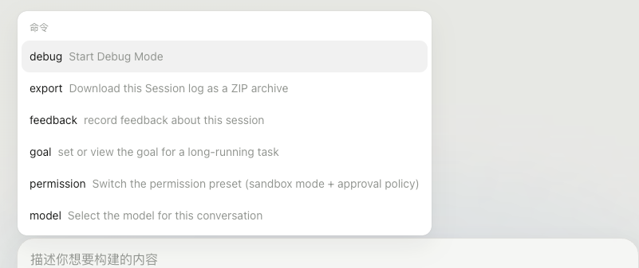

# dsh-debug-mode

English | [中文](README.zh.md)

Standalone runtime-first Debug Mode plugin for [DeepSeek Harness](https://github.com/deepseek-ai/deepseek-harness).



## Install

Prerequisites: Node.js `^22.19.0 || >=24.0.0`, pnpm on `PATH`, and DSH `0.1.0-rc.7` or later.

```sh
dsh plugin --profile web add "github:a554878526/dsh-debug-mode#main"
```

Restart the `web` profile, open a new task, run `/debug`, and then describe the bug. Remove it with:

```sh
dsh plugin --profile web remove dsh-debug-mode
```

### Recover history written by 0.1.1 or earlier

Versions through 0.1.1 wrote a required `debug-mode/state` event that an official DSH build does not recognize when reopening history. Stop `dsh web`, then run the repository's repair helper. It is read-only without `--apply`; apply mode backs up every changed compressed log before replacing it atomically.

```sh
python3 scripts/repair_debug_mode_sessions.py
python3 scripts/repair_debug_mode_sessions.py --apply
```

## Can later agents use the bundled scripts?

Yes. The package ships all four Python helpers in `scripts/`. When the Host loads `lib/index.js`, it resolves that installed directory relative to `import.meta.url` and registers it as the `debug-mode` skill's directory `resourceBase`. DSH therefore renders an absolute `<skill_resources>` directory for the agent, and the skill tells the agent to run the helper names from that directory. This works from a Git dependency, packed release, or local checkout without a machine-specific source path.

The plugin must be installed before the DSH process starts, and the user should open a new task after restart so the agent receives the newly registered skill. Python 3 must be available on the Host for the helper scripts.

## Develop

```sh
pnpm install
pnpm run check
```

For a local DSH profile smoke test, run this from the repository checkout and restart the profile:

```sh
dsh plugin --profile web add .
```

Runtime-first Debug Mode, one dual-face package. The host half registers the `debug-mode` skill, `/debug`, and process-local phase enforcement; the browser half exposes the command through the composer's always-available Commands menu and renders the active loop strip in `conversation.input.dock`.

Running `/debug` activates process-local setup state, opens the strip immediately, and queues the canonical rendered `debug-mode` skill content for the next real user turn; it does not wake the model by itself. The model therefore receives the fast-start contract without choosing the skill tool. The strip submits `继续分析`, `已修复，请清理调试日志和插桩代码`, or `退出 Debug Mode`. Fixed closes Host enforcement before the cleanup turn; Exit closes it without a model request. The plugin does not write a custom session event, so an out-of-tree install cannot make DSH history unreadable.

Four supported helpers ship under `scripts/` (`new_debug_session.py`, `debug_ingest_server.py`, `summarize_debug_log.py`, `find_instrumentation.py`). The runtime skill resolves that installed directory from `import.meta.url` and publishes it as its directory `resourceBase`, so source checkouts, packed releases, pnpm Git dependencies, and a standalone plugin repository use the same relative names without a machine-specific path. The skill requires these helpers first and permits inline fallback only after a helper is missing or fails.

The startup path optimizes for the first non-empty log: run the session helper, start its printed ingest command, inspect only enough code to place 1-3 probes, and emit the exact `<debug_reproduction_handoff>` wrapper. Setup exploration has no Debug Mode tool-count limit. The Host derives the session id, log path, and ingest URL from the successful helper result, observes the successful server command, and permits only `edit`/`write` content bound to those facts. Console-only probes, ordinary fixes, failed mutations, and mismatched handoffs cannot enter `waiting-for-repro`.

The helper may report an absolute log path while the handoff uses the documented repository-relative `.codex-debug/...` form. The Host compares these as one Debug Mode log identity, while a different log filename receives a dedicated path-mismatch error instead of the misleading “no probe” error.

Setup and analyzing responses pass through a Host-enforced `llm/stream` filter. The filter buffers complete setup responses, retains intermediate reasoning, tool calls, and usage for thinking-provider replay, and removes only ordinary text before the first handoff. During analyzing, ordinary verification reports pass unchanged, while a new handoff is validated and rendered like the first. Every round must establish fresh helper/server/probe facts and a log path not used by an earlier `waiting-for-repro` state. Continue is rejected before the first waiting state, then consumes one waiting message; it unlocks again only after the next round's waiting message.

Before Fixed, Host guards retain the evidence chain: analyzing cannot stop ingest jobs, delete `.codex-debug`, or remove a probe without replacing it with the next transport-backed probe. A proven fix produces a verification report and remains `analyzing`; only Fixed records `inactive` and admits cleanup of all round logs and jobs.

Before evidence arrives, the skill forbids reproduction tests, typechecks, builds, broad static analysis, and fixes. Browser/Electron probes must `fetch` to the running ingest server, which writes JSONL; console-only probes are invalid. Each generated template uses one inline `JSON.stringify` replacer that converts BigInt to a decimal string.

## Model Experience

### Runtime phase and loop controls

#### What the model sees

The `/debug` command records `setup` and queues the same `<skill_content name="debug-mode">` block returned by the skill loader; it enters model history with the next real user turn rather than starting a turn alone. The model emits handoff wrappers, but only Host-rendered reproduction instructions enter the session log. The dock disables Continue until the first instruction, consumes that waiting-message seq on click, and requires a later instruction before another Continue. Each click records `analyzing` before its user message enters the request. Fixed records `inactive` before its cleanup message enters; Exit records `inactive` and rejects the control turn before any model request.

#### Token effect

`/debug` adds the rendered skill context to the next real request but spends no request by itself. A valid handoff contributes one compact Host-rendered assistant message. Continue and Fixed each add one short user message; Exit adds no model tokens.

#### KV Cache effect

The rendered skill context and Host-rendered handoff join the request's appended suffix; Continue and Fixed append one user message. No Debug Mode tool schema is added, and Exit leaves the cache input unchanged.

## Known Limitations and Deferred Work

- **Debug Mode state is process-local** — a Host restart, page reload, or session reopen ends the active loop. Run `/debug` again to restore the controls and restart setup. This avoids writing an out-of-tree event type that the current DSH persistence API cannot mark ignorable.
- **Exit does not retract queued context** — if the user exits before sending the next real message, the already queued activation context still enters that next request even though Host enforcement is inactive.
- **Setup output is intentionally buffered** — tool activity appears only after each model response completes; this prevents discarded diagnosis text from streaming into the UI.
- **Cleanup runs in the next model turn** — `已修复` submits a message rather than deleting files itself; the skill directs the model to remove probes and delete `.codex-debug/` logs. Mechanical cleanup is therefore model-owned, not a host service.
- **Helper and server recognition use their packaged command names** — Host enforcement recognizes successful `new_debug_session.py` and `debug_ingest_server.py` calls, then binds probe content and handoff data to the helper output. Alternative transports must use the packaged fallback contract or extend this recognizer.
